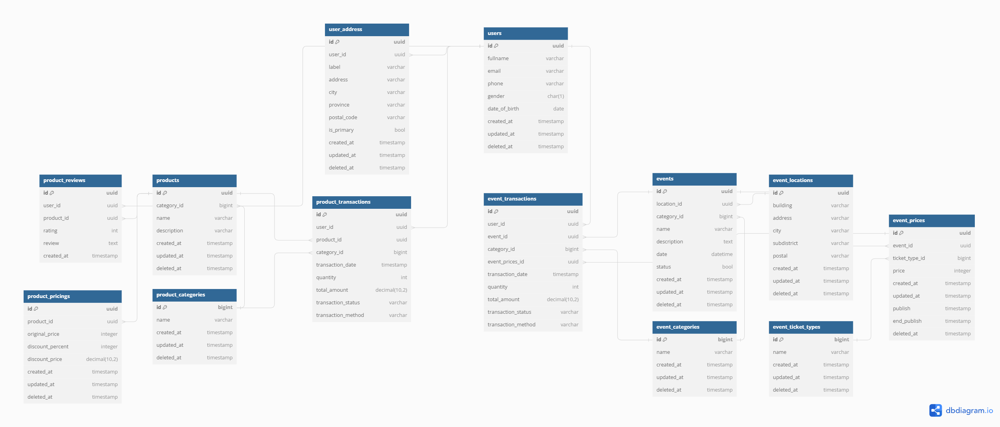
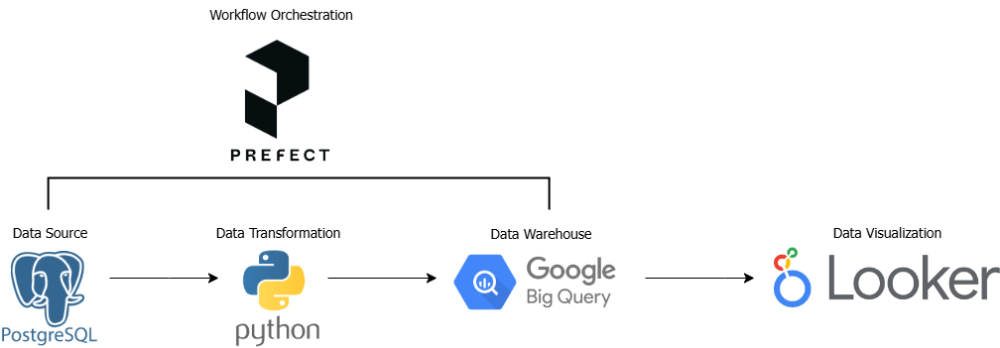

# Data Engineering Services for Alterra Academy Capstone Project - Team 7

## ETL Pipeline with Python and Prefect 2.19.4

Designing and developing a data pipeline for Kreasi Nusantara, a platform that facilitates shopping for local products and purchasing tickets for Indonesian cultural events. The process involves extracting data, performing data transformation, loading data into a data warehouse, and creating dashboards for analytical purposes.

## Data Warehouse Schema



## ETL Architecture



## Prerequisites

1.  **Python 3.10+:** Ensure you have Python version 3.10 or later installed.
2.  **Prefect 2.19.4:** Install Prefect using the command `pip install prefect==2.19.4`.
3.  **Prefect Cloud Account:** Create a free account at [https://www.prefect.io/](https://www.prefect.io/).
4.  **Prefect Cloud Credentials:** Store the Prefect Cloud API key securely.
5.  **Additional Credentials:**
    * **Database Credentials:** Prepare credentials to access the database (e.g., username, password, host, database name).
    * **GitHub Personal Access Token (PAT):** Create a GitHub PAT with appropriate permissions to access the repository.
    * **GCP Service Account Key:** Create a service account key in Google Cloud Platform with the necessary permissions to access the GCP services being used.

## Installation

1.  **Clone the Repository:**
    ```bash
    git clone https://github.com/capstone-tim-7-alterra/data-pipeline.git
    ```

2.  **Install Dependencies:**
    ```bash
    pip install -r requirements.txt
    ```

## Prefect Cloud Configuration and Blocks

1.  **Log in to Prefect Cloud:**
    ```bash
    prefect cloud login
    ```
    Enter the API key when prompted.

2. **Create and Configure Blocks:**
    * Open Prefect Cloud in a browser.
    * Navigate to "Blocks".
    * **Database Blocks:**
        * Create new blocks of type "Secret" for each database credential (e.g., `db-username`, `db-password`, `db-host`, `db-name`).
        * Enter the values of the database credentials in the respective blocks.
    * **GitHub Block:**
        * Create a new block of type "Secret".
        * Name it `github-access-token`.
        * Enter the GitHub PAT.
    * **GCP Block:**
        * Create a new block of type "GCP Credentials".
        * Name it `gcp-service-account`.
        * Upload the service account key JSON file.

3. **Create a Work Pool (Optional):**
    * Open Prefect Cloud in a browser.
    * Navigate to "Work Pools".
    * Click "New Work Pool".
    * Name the work pool (e.g., "etl-pipeline-work-pool").
    * In the "Pip Packages" section, copy the contents of `requirements.txt` into the provided field.
    * Save the work pool.

## Deployment and Execution

1. **Run the Deployment:**
    ```bash
    python code/deployment.py
    ```
    * This script will create a Prefect deployment for the ETL pipeline.
    * Ensure the ETL code (`main.py`) reads the configuration from the created blocks.
    * If using a work pool, ensure the deployment uses the created work pool.

2. **Monitor in Prefect Cloud:**
    * Open Prefect Cloud.
    * The new deployment will be visible and can be triggered manually or scheduled.